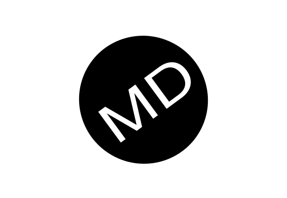

[](https://www.codefactor.io/repository/github/dgramop/matdark)  [](https://travis-ci.org/dgramop/MatDark)

# MatDark 
MatDark is _the_ CSS and JS framework to make websites easier for the user to use and the developer to develop!

Styles don't distract, they enhance


It:
- simplifies coding by overriding native methods
- uses easy to guess class names (like "card" instead of stuff like "Mat_Dark-card" and crap like that)
- Is high contrast
	- friendly for people who need high contrast
	- Easy on the eyes
	- Still easy to read

Need to open a modal?

```
alert("This is a modal <b>That also supports HTML</b>");
```

How about a little on-page notification?

```
toast("Hi!")
```


We'll keep adding new features, and making hard things easy (like the notifications API.)

We might add universal configuration files, allowing you to customize the look of MatDark

We want to rethink the library, by breaking conventions and stereotypes in order to give the user and developer the best experience.

MatDark is _not_ to be confused with Material, or Material Design, although its name is derived from Material + Flat. 


## Contributers
<small>As of now, people who commit or pull request regularly will be added here. </small>
<small>As the standards go up, or if you fail to pull or commit for a while, you may be removed.</small>
@AutinTech for the fantastic graphic, shadows etc.
@VictorNova for our CSS inverting script, making MatLight a possibility. (@AutinTech's idea for a light color scheme)
